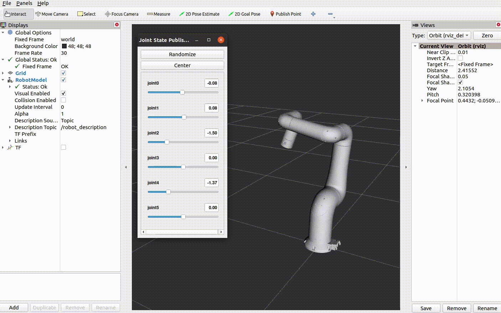

# Indy ROS2 Driver

## Introduction

**Indy** is Neuromeka’s flagship cobot model we designed and manufactured. Guaranteeing workers’ safety based on innovative collision detection algorithms, Indy supports more intuitive direct teaching by impedance control as well as online and offline programming with the teach pendant app running on android tablets.

<center></center> 


This repository contains ROS2 drivers for Indy7, Indy12 and IndyRP2.


## Preparation

The following software needs to be installed:
- [ROS2 Foxy](https://docs.ros.org/en/foxy/Installation.html)
- [Moveit2](https://moveit.picknik.ai/foxy/index.html)
- [Gazebo ros2 control](https://github.com/ros-controls/gazebo_ros2_control)
- [Ros2 control](https://github.com/ros-controls/ros2_control)
- [Ros2 controllers](https://github.com/ros-controls/ros2_controllers)


## Installation

### Install dependencies
```
sudo apt install python3-vcstool
sudo apt install python3-colcon-common-extensions

sudo apt install ros-foxy-xacro
sudo apt install ros-foxy-moveit
sudo apt install ros-foxy-moveit-servo
sudo apt install ros-foxy-ros2-control
sudo apt install ros-foxy-ros2-controllers
sudo apt install ros-foxy-moveit-ros-move-group
sudo apt install ros-foxy-moveit-planners-ompl
sudo apt install ros-foxy-moveit-kinematics
sudo apt install ros-foxy-gazebo-ros
sudo apt install ros-foxy-gazebo-ros2-control
sudo apt install ros-foxy-controller-manager
sudo apt install ros-foxy-joint-state-controller
sudo apt install ros-foxy-joint-state-broadcaster
sudo apt install ros-foxy-joint-state-publisher-gui
sudo apt install ros-foxy-joint-trajectory-controller
```

### Create a workspace and download the source code

```
cd ~
mkdir -p indy_ros2/src
cd ~/indy_ros2/src
git clone <this repository url>
```

### Build Indy driver

```
cd ~/indy_ros2/
colcon build
```

### Source the setup file
```
. install/setup.bash
```

## Usage

Use **indy_type** to choose specific robot **(indy7, indy7_v2, indy12, indyrp2, indyrp2_v2)**.
Use **indy_eye** to enable Indy Eye model **(support indy7, indyrp2)**. 
To enable Indy Eye, add **indy_eye:=true** to the end of command

If not specified, the default value will be indy7.

When used with a real robot, you need to provide an **indy_ip** value.

### Start Indy description

```
ros2 launch indy_description indy_display.launch.py indy_type:=indy7
```




### Simulation Robot

#### Start Indy Gazebo Robot

```
ros2 launch indy_gazebo indy_gazebo.launch.py indy_type:=indy7
```


#### Start Indy Gazebo with Moveit

```
ros2 launch indy_moveit indy_moveit_gazebo.launch.py indy_type:=indy7
```


#### Start Indy Gazebo with Servoing

```
ros2 launch indy_moveit indy_servo_gazebo.launch.py indy_type:=indy7
```


### Real Robot

#### Start Indy Robot

```
ros2 launch indy_driver indy_bringup.launch.py indy_type:=indy7 indy_ip:=192.168.xxx.xxx
```


#### Start Indy with Moveit

```
ros2 launch indy_moveit indy_moveit_real_robot.launch.py indy_type:=indy7 indy_ip:=192.168.xxx.xxx
```


#### Start Indy with Servoing

```
ros2 launch indy_moveit indy_servo_real_robot.launch.py indy_type:=indy7 indy_ip:=192.168.xxx.xxx
```

